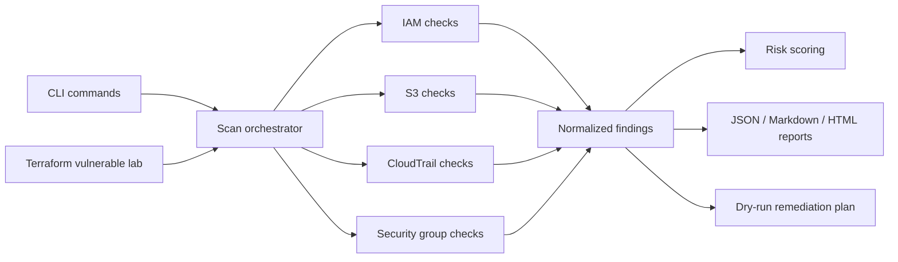

# CloudGuard Automator

[](https://github.com/sanyasachdeva1/cloudguard-automator/actions/workflows/ci.yml)

CloudGuard Automator is a cloud security automation toolkit for auditing AWS environments for common IAM, S3, CloudTrail, and network exposure risks.

The goal is to build a practical CSPM-style toolkit that can run in demo mode or against AWS credentials to identify common misconfigurations, assign severity, and generate remediation-ready reports.

## Why This Project Matters

Cloud environments fail in predictable ways: public storage, over-permissive IAM, missing logging, and exposed network services. This toolkit turns those risks into repeatable checks that can be run from a terminal, CI job, or security workflow.

## How This Is Different

CloudGuard Automator is intentionally not a replacement for mature tools like Prowler, ScoutSuite, CloudSplaining, or AWS Security Hub. Instead, it is a focused portfolio-grade implementation that demonstrates how cloud security posture automation works end to end.

What makes this project distinct:

- Small, readable codebase focused on core AWS risks instead of broad multi-cloud coverage
- End-to-end workflow: vulnerable Terraform lab, scanner, findings, reports, and dry-run remediation
- Demo mode for review without AWS credentials
- Control mappings surfaced directly in reports
- Least-privilege scanner permissions documented for safe live usage
- HTML and Markdown reports designed for portfolio and demo review

## Implemented Capabilities

- IAM baseline checks for MFA, password policy, stale access keys, direct admin attachment, and wildcard policies
- S3 exposure checks for public ACLs, public policies, missing encryption, missing versioning, missing access logging, and Block Public Access
- CloudTrail logging baseline checks for active logging, multi-region coverage, log validation, KMS encryption, and management events
- EC2 security group exposure checks for public admin ports, public database ports, all-traffic rules, IPv6 exposure, and broad port ranges
- JSON, Markdown, and HTML reporting
- Dry-run remediation plans with AWS CLI commands and manual review guidance
- Terraform-based vulnerable AWS lab for repeatable demos
- Demo mode for portfolio screenshots without needing live AWS credentials

## Architecture



## Demo Preview

Sample outputs are included so the project can be reviewed without AWS credentials:


- [Sample Markdown report](reports/sample_report.md)
- [Sample HTML report](reports/sample_report.html)

```text
Risk score: 55/100
Risk level: medium
Critical: 1
High: 2
```

## Risk Scoring

Findings are scored by severity to create a simple account-level risk summary. Critical, high, medium, and low findings contribute weighted points, capped at 100, and the final score is grouped into informational, low, medium, high, or critical risk levels.

The scoring logic lives in [cloudguard_automator/risk.py](cloudguard_automator/risk.py).

## Control Mapping

CloudGuard Automator includes lightweight control mapping and AWS permission guidance:

- [Control mapping](docs/control_mapping.md)
- [AWS permissions for scanner use](docs/aws_permissions.md)
- [Live scan validation checklist](docs/live_scan_validation.md)

## Tests

```bash
pip install -e ".[dev]"
pytest
```

The test suite validates finding generation, risk scoring, report rendering, Terraform lab configuration, and remediation plan output.

## Future Improvements

- Security Hub and AWS Config-style compliance mapping
- CIS AWS Foundations Benchmark coverage expansion
- Additional services: KMS, EBS, Lambda, and RDS
- GitHub Actions scheduled scan example
- Optional apply mode for selected remediations

## Quick Start

```bash
python -m venv .venv
source .venv/bin/activate
pip install -e .
```

Run demo mode:

```bash
cloudguard scan --demo --format markdown --output reports/demo_report.md
cloudguard scan --demo --format html --output reports/demo_report.html
```

Run against AWS credentials configured in your environment:

```bash
cloudguard scan --profile default --regions us-east-1 ap-south-1 --format json
```

Generate a dry-run remediation plan:

```bash
cloudguard remediate --demo --dry-run --format markdown --output reports/demo_remediation.md
```

Run the vulnerable AWS lab in a sandbox account:

```bash
cd terraform/lab
terraform init
terraform apply
```

Then scan it from the repository root:

```bash
cloudguard scan --profile default --regions us-east-1 --format markdown --output reports/lab_scan.md
cloudguard remediate --profile default --regions us-east-1 --dry-run --format markdown --output reports/lab_remediation.md
```

## Example Finding

```text
HIGH: S3 bucket "company-backups" does not block public access.
Risk: Publicly exposed storage can leak sensitive files or backups.
Remediation: Enable S3 Block Public Access at the bucket or account level.
```

## Safety

This project starts as a read-only scanner. Remediation features will be added behind explicit dry-run/apply flags so changes are deliberate and auditable.
