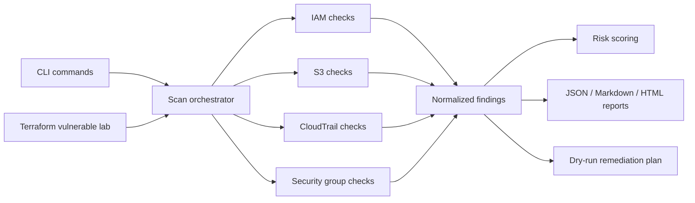
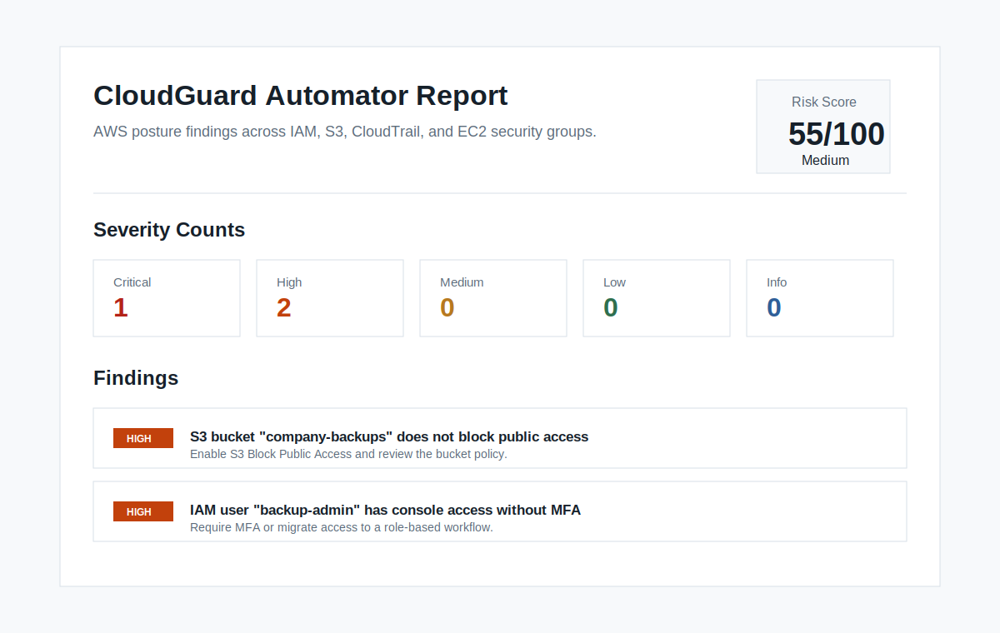

# CloudGuard Automator

[](https://github.com/sanyasachdeva1/cloudguard-automator/actions/workflows/ci.yml)


AWS cloud security posture scanner that detects common IAM, S3, CloudTrail, and EC2 security group misconfigurations.
It runs in demo mode or against AWS credentials, assigns severity, generates JSON/Markdown/HTML reports, and produces dry-run remediation plans.
> Built as a portfolio-grade CSPM-style project to demonstrate cloud security automation, risk scoring, reporting, and remediation workflow design.

## Why This Project Matters
Cloud environments often fail through predictable misconfigurations: public storage, weak IAM controls, missing logging, and exposed network services.
This project turns those risks into repeatable security checks that can be run locally, in demo mode, or as part of a CI/security workflow.

## What It Checks

| Area | Checks |
|---|---|
| IAM | MFA, password policy, stale access keys, admin attachment, wildcard policies |
| S3 | Public ACLs/policies, missing encryption, missing versioning, access logging, Block Public Access |
| CloudTrail | Active logging, multi-region trails, log validation, KMS encryption, management events |
| EC2 Security Groups | Public admin ports, database exposure, all-traffic rules, IPv6 exposure, broad port ranges |
| Reporting | JSON, Markdown, HTML, risk score, severity summary |
| Remediation | Dry-run AWS CLI/manual remediation guidance |

## Architecture



## What Makes This Different

This is not a replacement for Prowler, ScoutSuite, CloudSplaining, or AWS Security Hub.

It is a focused portfolio-grade implementation showing how CSPM-style automation works end to end:

- Vulnerable Terraform lab
- Python scanner
- Normalized findings
- Risk scoring
- Control mapping
- HTML/Markdown reports
- Dry-run remediation plans

## Resume Relevance

This project demonstrates hands-on experience with:

- AWS cloud security posture management
- IAM, S3, CloudTrail, and network exposure checks
- Python security automation with boto3
- Risk scoring and remediation planning
- Terraform-based vulnerable lab design
- pytest and GitHub Actions CI

## Demo Preview

Sample outputs are included so the project can be reviewed without AWS credentials:



- [Sample Markdown report](reports/sample_report.md)
- [Sample HTML report](reports/sample_report.html)

```text
Risk score: 55/100
Risk level: medium
Critical: 1
High: 2
```

## Risk Scoring

Findings are scored by severity to create a simple account-level risk summary. Critical, high, medium, and low findings contribute weighted points, capped at 100, and the final score is grouped into informational, low, medium, high, or critical risk levels.

The scoring logic lives in [cloudguard_automator/risk.py](cloudguard_automator/risk.py).

## Control Mapping

CloudGuard Automator includes lightweight control mapping and AWS permission guidance:

- [Control mapping](docs/control_mapping.md)
- [AWS permissions for scanner use](docs/aws_permissions.md)
- [Live scan validation checklist](docs/live_scan_validation.md)

## Tests

```bash
pip install -e ".[dev]"
pytest
```

The test suite validates finding generation, risk scoring, report rendering, Terraform lab configuration, and remediation plan output.

## Future Improvements

- Security Hub and AWS Config-style compliance mapping
- CIS AWS Foundations Benchmark coverage expansion
- Additional services: KMS, EBS, Lambda, and RDS
- GitHub Actions scheduled scan example
- Optional apply mode for selected remediations

## Quick Start

```bash
python -m venv .venv
source .venv/bin/activate
pip install -e .
```

Run demo mode:

```bash
cloudguard scan --demo --format markdown --output reports/demo_report.md
cloudguard scan --demo --format html --output reports/demo_report.html
```

Run against AWS credentials configured in your environment:

```bash
cloudguard scan --profile default --regions us-east-1 ap-south-1 --format json
```

Generate a dry-run remediation plan:

```bash
cloudguard remediate --demo --dry-run --format markdown --output reports/demo_remediation.md
```

Run the vulnerable AWS lab in a sandbox account:

```bash
cd terraform/lab
terraform init
terraform apply
```

Then scan it from the repository root:

```bash
cloudguard scan --profile default --regions us-east-1 --format markdown --output reports/lab_scan.md
cloudguard remediate --profile default --regions us-east-1 --dry-run --format markdown --output reports/lab_remediation.md
```

## Example Finding

```text
HIGH: S3 bucket "company-backups" does not block public access.
Risk: Publicly exposed storage can leak sensitive files or backups.
Remediation: Enable S3 Block Public Access at the bucket or account level.
```

## Safety

This project starts as a read-only scanner. Remediation features will be added behind explicit dry-run/apply flags so changes are deliberate and auditable.

## License

This project is licensed under the [MIT License](LICENSE).
